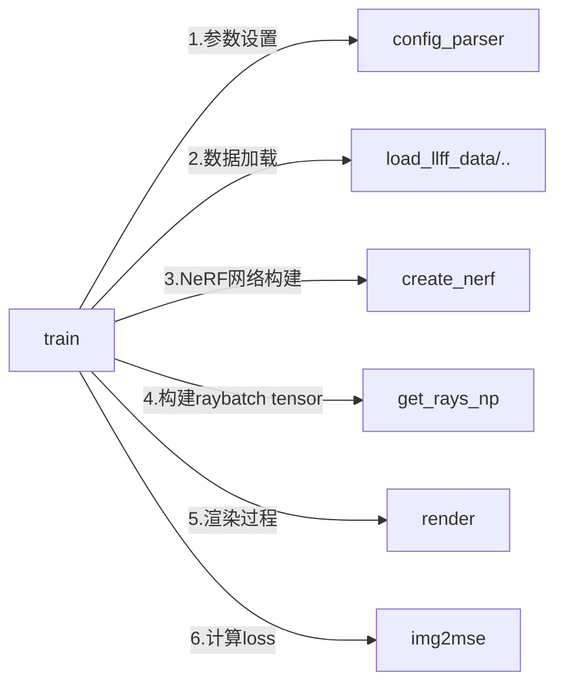
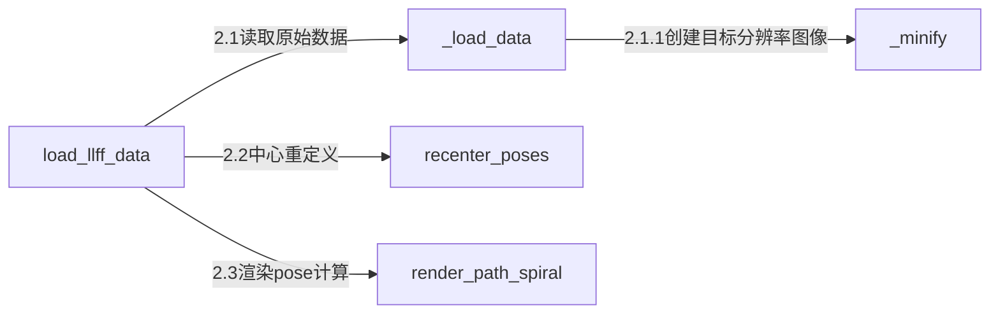
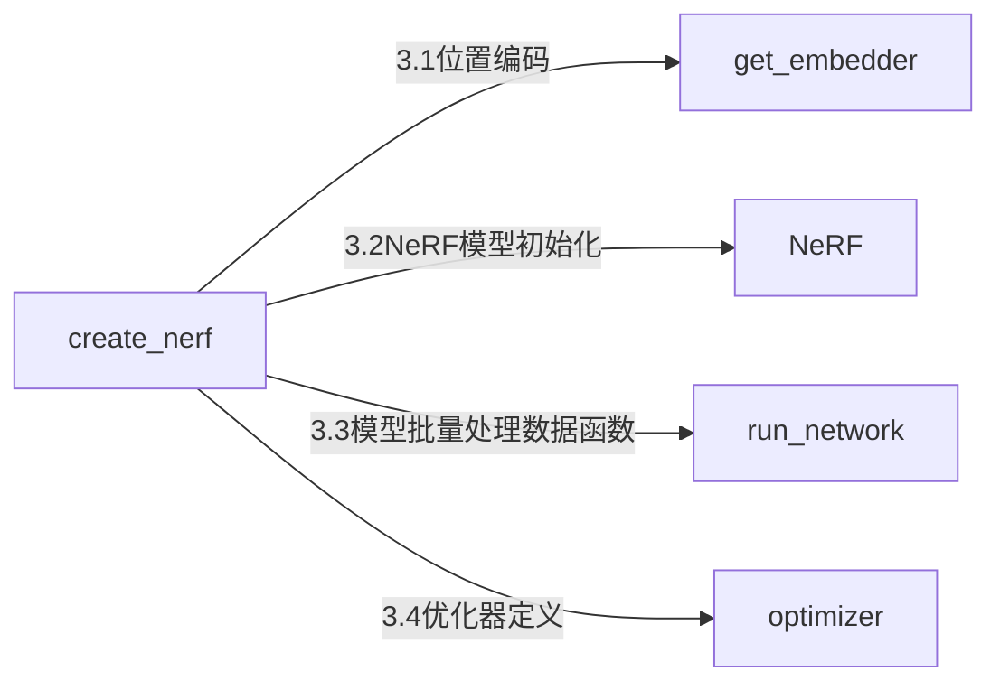
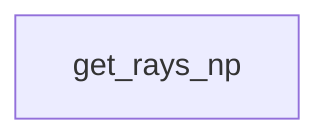
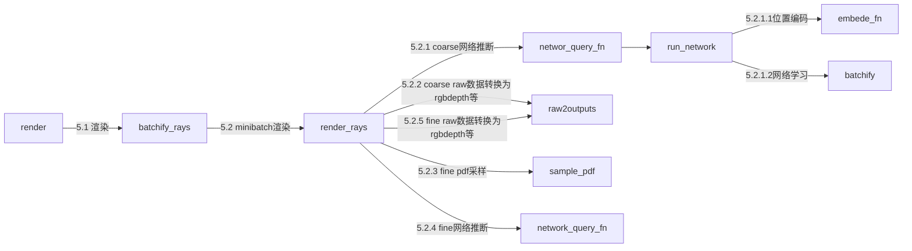

# 1. NeRF论文笔记

详细论文笔记见Zotero上pdf的笔记

## 1.1 什么是NeRF

- NeRF (Neural Radiance Fields)即神经辐射场，他用一个MLP神经网络去隐式地学习一个三维场景。
  - 输入：稀疏的多角度 且 有位姿的图像
  - 输出：神经辐射场模型（根据此模型可以渲染出任意角度下的照片）
  
- NeRF本质上是完成了3D渲染功能

  - 渲染：将场景定义（包括摄像机、灯光、表面几何和材料）转换为模拟摄像机图像的过程。

    简单来说就是模拟相机的拍照过程，生成的结果是该视角下看到的一张照片

  - 传统方法有光栅化（rasterization），光线追踪（ray tracing）

    相关课程：

    - [GAMES101 现代计算机图形学入门](https://www.bilibili.com/video/BV1X7411F744/?spm_id_from=333.337.search-card.all.click)

- 隐式表达和显式表达：

  - 隐式表达Implicit：告诉3D点满足特定的关系，而不是具体的点在哪里。
  
    例子：
  
    - 一个公式：$f(x,y,z)=0$
    - SDF
    - NeRF
  
  - 显示表达Explicit：直接给出3D点或3D点的参数映射
  
    例子：
  
    - 点云
    - 网格
    - 体素
  
- 缺点：

  - 训练和推理都很慢，但用了Tiny-cuda-nn的话就快的离谱。
  - 只能表示静态的场景
  - 对光照处理不好
  - 训练的模型都只能代表一个场景，没有泛化能力

## 1.2 NeRF原理

1. **神经辐射场网络**：输入5D坐标$(x,y,z,\theta,\phi)$到MLP训练得到颜色$C$和体密度$\sigma$. (2D->3D)

   - march camera rays through the scene to generate a sampled set of 3D points

   - use those points and their corresponding 2D viewing directions as input to the neural network to produce an output set of colors and densities

2. **体渲染**：使用体渲染技术，将颜色和体密度渲染出RGB图片. (3D->2D)

   - use classical volume rendering techniques to accumulate those colors and densities into a 2D image

## 1.3 NeRF公式

1. **神经辐射场网络**

   - 公式：
     $$
     F_\theta:(\mathbf{x,d})\rightarrow(\mathbf{c},\sigma)\tag{1}
     $$
     

     - $F_\theta$: MLP神经网络

     - $\mathbf{x}$: 3D坐标

     - $\mathbf{d}$: 2D照片视角方向即$(\theta,\phi)$

     - $\mathbf{c}$: 颜色

     - $\sigma$: 体密度（也叫不透明度，消光系数）

   - 神经网络实现

     1. 用8个全连层训练输入坐标X，输出不透明度$\sigma$和256维的特征向量
        - 激活函数：ReLU
        - 每层256个通道(channels)
     2. 然后用一个全连接层训练这个特征向量和相机视角，最后得到这个视角下的RGB值
        - 激活函数：ReLU
        - 每层128个通道

2. **体渲染**

   1. 参考论文：[Optical Models for Direct Volume Rendering](https://courses.cs.duke.edu/spring03/cps296.8/papers/max95opticalModelsForDirectVolumeRendering.pdf)  得到光学吸收发射模型
      $$
      C(\mathbf{r})=\displaystyle \int_{t_n}^{t_f}T(t)\sigma(\mathbf{r}(t))\mathbf{c}(\mathbf{r}(t),\mathbf{d})dt,\ where\ T(t)=exp(-\displaystyle \int_{t_n}^t\sigma(\mathbf{r}(s))ds) \tag{2}
      $$

      - $C(\mathbf{r})$：是光线r(t)处期望的颜色
      - $t_n,t_f$：是最近和最远平面深度（相机到该点的距离）
      - $T(t)$​：累积的透明度，光线$t_n$传播到$t$而不撞击任何其他粒子的概率。
      - $\sigma(\mathbf{r}(t))$：神经辐射场算出来的体积密度，也就是消光系数（不透明度）
      - $\mathbf{c}(\mathbf{r}(t),\mathbf{d})dt$：神经辐射场算出来的颜色

   2. 将近远平面等分成N份，在每份小区间内取样
      $$
      t_i\sim \mathcal{U}\big[t_n+\frac{i-1}{N}(t_f-t_n),t_n+\frac{i}{N}(t_f-t_n)\big] \tag{3}
      $$

   3. 将2式写成电脑可处理的离散模式，将神经辐射场从3式中采样学来的各个颜色和体密度，渲染出近似颜色
      $$
      \hat{C}(\mathbf{r})=\sum_{i=1}^NT_i(1-exp(-\sigma_i\delta_i))\mathbf{c}_i,\ where\ T_i=exp(-\sum_{j=1}^{i-1}\sigma_j\delta_j) \tag{4}
      $$

      - $\delta_i=t_{i+1}-t_i$: 最近adjacent取样之间的距离

3. **LOSS函数**
   $$
   \mathcal{L}=\sum_{\mathbf{r}\in\mathcal{R}}\big[||\hat{C}_c(\mathbf{r})-C(\mathbf{r}) ||_2^2+||\hat{C}_f(\mathbf{r})-C(\mathbf{r}) ||_2^2\big]
   $$

   - 这里精细/粗糙网络算出来的RGB值$\hat{C}$具体见1.6.2

## 1.4NeRF的两个优化

直接将5D坐标送入MLP学习，没法表达高分辨率的复杂场景，所以使用了2个提升措施：

### 1.4.1 Positional encoding

由于5D输入在颜色和几何的高频变换方面表现不好，所以在5D输入传递到NeRF网络之前，使用高频函数将输入映射到更高维空间可以更好地拟合包含高频变换的数据。

- 什么是高频/低频信号：

  - 高频信号：表示图像中灰度值变化剧烈的区域，对应着图像的边缘（轮廓）、噪声以及细节部分
  - 低频信号：低频就是颜色缓慢地变化,也就是灰度缓慢地变化,就代表着那是连续渐变的一块区域。

- 位置编码怎么做：

  将5D坐标进行一个类似于傅里叶变换的操作，将其映射到高维空间，然后再作为MLP的输入。

  神经网络变成：$F_\theta=F'_\theta\circ\gamma$

  - $F'_\theta$：还是简单的MLP

  - $\gamma$：类似傅里叶的映射（转变成sin,cos的组合，具体公式见论文）

    在论文中：

    - 对$x,y,z$ L选择10，从而3个变量变成60个变量
    - 对$\theta,\phi$ L选择4，从而2个变量变成24个变量

- 为什么傅里叶变换后可以学习到更多特征？见[论证论文](https://arxiv.org/abs/2006.10739)

### 1.4.2 Hierarchical volume sampling

为了解决对渲染图像没有贡献的自由空间和遮挡区域仍然被重复采样的问题，这里采用了层级采样。

但一开始我们并不知道哪些点是有用的，哪些是没用的，所以一开始粗采样，然后精细采样。

层级采样会同时优化2个NeRF网络，一个粗糙coarse，一个精细fine。

层级采样具体实现：

1. 首先根据上面3式进行$N_c$次粗采样(即采样的稀疏一点)，论文里选了64个采样点

2. 根据4式改写为下面5式
   $$
   \hat{C}_c(\mathbf{r})=\sum_{i=1}^{N_c}w_i\mathbf{c}_i,\ \ \ \ \ w_i=T_i(1-exp(-\sigma_i\delta_i)) \tag{5}
   $$

   - 由5式渲染完粗糙网络后，归一化得到一个权重值$\hat{w}_i=w_i/\sum_{j=1}^{N_c}$
   - 这个权重可以看成沿着射线的**分段-常数概率密度函数**(piecewise-constant PDF)
   - 这个权重值因为只和体密度(不透光率)$\sigma$有关，所以它告诉了我们这条射线上哪些部分是有物体的，也即我们需要渲染的东西

3. 根据上面算出的权重值进行inverse transform sampling**逆变换采样**，精细选出$N_f$个采样点，论文里选了128个点
   - 这样选出来的128个点，就会集中于我们想要渲染的目标
4. 最后使用2次采样$N_c+N_f$，即64+128个采样点的数据，来渲染出最终的颜色$\hat{C}_f(\mathbf{r})$

## 1.5 性能指标PSNR/SSIM/LPIPS

- PSNR（峰值信噪比，Peak Signal-to-Noise Ratio）
  - PSNR 最小值为 0，PSNR 越大，两张图像差异越小
- SSIM （结构相似性指数，structural similarity index）
  - SSIM 越大，两张图像越相似
- LPIPS（学习感知图像块相似度，Learned Perceptual Image Patch Similarity)
  - LPIPS的值越低，表示两张图像越相似

## 1.6 生成自己的数据集

参考1：课程

参考2：[知乎](https://zhuanlan.zhihu.com/p/576416530)

- 第一步：采集图像
  - 方法1：自己拍照
  - 方法2：使用[dtu数据集](https://roboimagedata.compute.dtu.dk/?page_id=36)，[tanks and temples数据集](https://www.tanksandtemples.org/download/)
- 第二步：位姿计算
  - 方法1：使用OpenMVG/SLAM
  - 方法2：使用colmap计算位姿
- 第三步：转换成llff数据格式

# 2. NeRF源码笔记

## 2.1 NeRF源码安装

- [NeRF论文](https://www.matthewtancik.com/nerf)是用TensorFlow做的：[TensorFlow版本](https://github.com/bmild/nerf)

- 使用别人写好的[Pytorch版本](https://github.com/yenchenlin/nerf-pytorch)的NeRF

  ```
  git clone https://github.com/yenchenlin/nerf-pytorch.git
  cd nerf-pytorch
  pip install -r requirements.txt
  ```

- 具体如何运行见[Pytorch版本](https://github.com/yenchenlin/nerf-pytorch)的README。

  ```shell
  # 下载数据集lego和fern,在nerf-pytorch文件夹下：
  bash download_example_data.sh
  # train a low-res lego NeRF:
  python run_nerf.py --config configs/lego.txt
  # train a low-res fern NeRF:
  python run_nerf.py --config configs/fern.txt
  ```

- 实测可运行：

  ```
  Pytorch:2.0.0
  Cuda(conda):11.8
  Cuda(系统):12.1
  Ubuntu:20.04
  ```

  

## 2.2 Instant-ngp安装

[Instant-ngp](https://github.com/NVlabs/instant-ngp)使用了[Tiny-cuda-nn](https://github.com/NVlabs/tiny-cuda-nn)5s算完NeRF,否则要算五个半小时

```
$ git clone --recursive https://github.com/nvlabs/instant-ngp
$ cd instant-ngp
$ cmake . -B build -DCMAKE_CUDA_COMPILER=/usr/local/cuda-12.1/bin/nvcc -DTCNN_CUDA_ARCHITECTURES=61
$ cmake --build build --config RelWithDebInfo -j
```

- 如何使用见git[主页](https://github.com/NVlabs/instant-ngp#usage)

- 实测可运行

  ```
  Pytorch:2.0.0
  Cuda(conda):11.8
  Cuda(系统):12.1
  Ubuntu:20.04
  CMake:3.26.3
  ```


## 2.3 代码调试

在2.1中运行代码时需要同时给入配置文件，在debug时同样需要配置一下：

1. VSCODE打开NeRF代码仓库文件夹

2. 点开`Run and Debug`，然后点`create a launch.json file`

3. 将运行命令参数输入进去

   ```json
   {
       "version": "0.2.0",
       "configurations": [
           {
               "name": "Python: Current File",
               "type": "python",
               "request": "launch",
               "program": "${file}",
               "console": "integratedTerminal",
               "justMyCode": true,
               // 比如调试fern这个数据集
               // 将命令“python run_nerf.py --config configs/fern.txt”中的参数加入到当前配置文件中
               "args": [
                   "--config","configs/fern.txt"
               ]
           }
       ]
   }
   ```

## 2.4 代码运行流程



### 2.4.1 参数设置

参数见代码的`config_parser`类，要修改训练参数/数据集/保存地址等等可以通过:

1. 直接修改类里的默认值
2. 编写configs.txt，然后运行代码时作为参数传入

### 2.4.2 数据加载



- 这里用的是llff数据格式：

  LLFF格式数据可以将对应图片参数、相机位姿和相机参数简洁有效地存储在一个npy文件中，以方便python读取，NeRF模型源码有直接对LLFF格式数据集进行训练的配置和模块`load_llff_data`。

### 2.4.3 NeRF网络构建




- 位置xyz从3维位置编码成63维的高维空间后用8层256通道神经网络去学习得到256个特征值和不透明度$\sigma$
- 方向$\theta,\varphi$从2维位置编码成27维的高维空间后和不透明度$\sigma$用一层128通道神经网络学习得到RGB值
- 在第五层，xyz的高维空间值还会传入一遍

### 2.4.4 生成光线ray数据



世界坐标系转到图像坐标系


### 2.4.5 渲染过程




